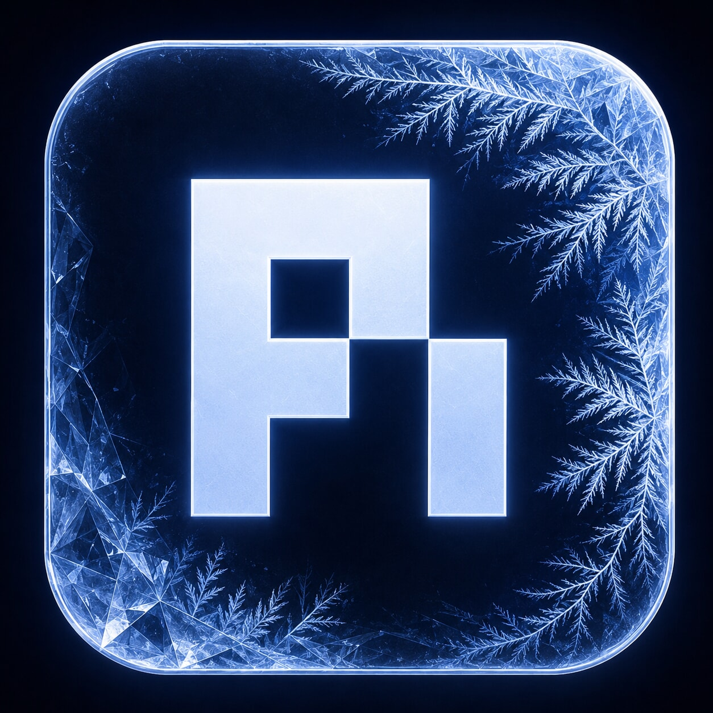
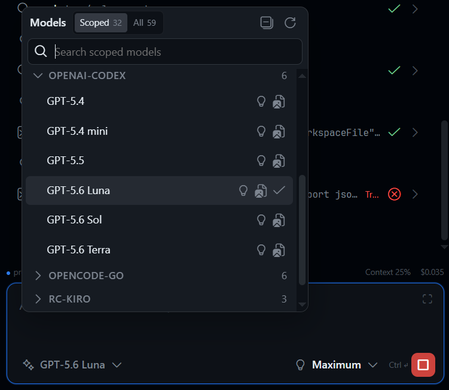
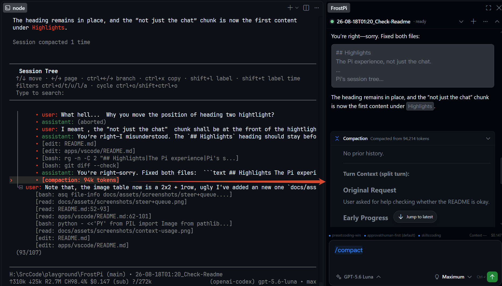
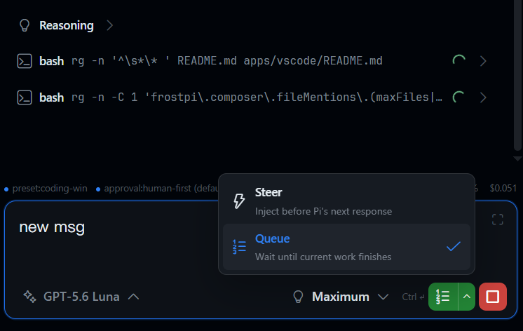
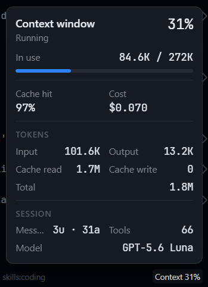
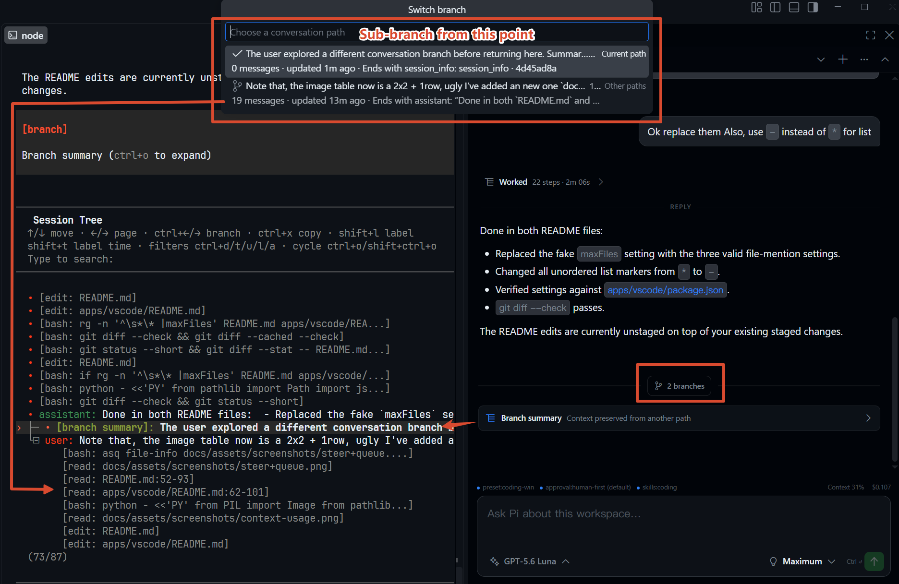
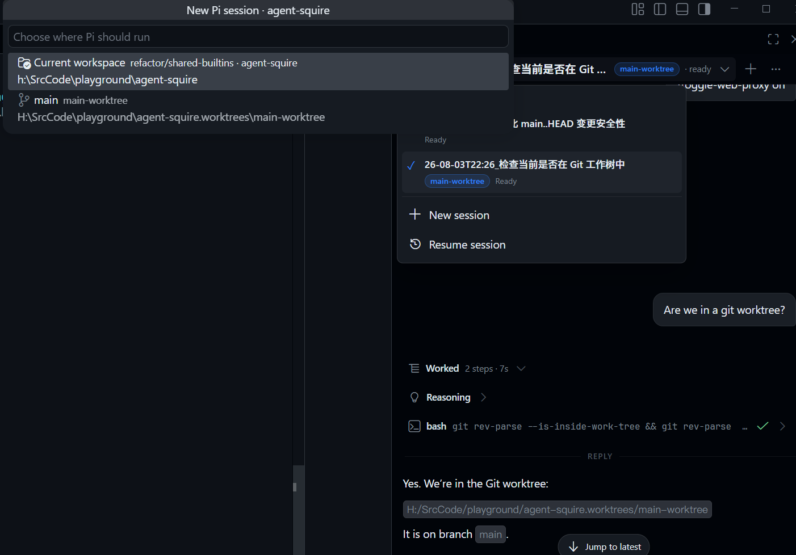

<p align="center">
  
</p>

<h1 align="center">Pi VS Code UI — FrostPi</h1>

<p align="center">
  <strong>A visual VS Code UI for Pi Coding Agent, built around the Pi you already use.</strong>
</p>

<p align="center">
  <a href="README.md">English</a> ·
  <a href="README.zh-CN.md">简体中文</a>
</p>

FrostPi brings your existing Pi Coding Agent workflow into VS Code without replacing your configuration, extensions, models, or sessions.

<p align="center">
  
</p>

## Why FrostPi

If you already use Pi and have built your own workflow around it, getting a GUI shouldn't mean adopting another one.

FrostPi uses **your Pi, your configuration, your extensions, your models, and your sessions**. It does not maintain a parallel Pi setup, inject a system prompt, or try to manage your workflow for you.

**FrostPi handles the GUI. Pi stays in charge.**

## Highlights

**The Pi experience, not just the chat.**

FrostPi aims to keep Pi's functional workflows available from the GUI: extension commands, prompt templates, skills, model selection, thinking controls, Resume, `/compact`, tree summaries, custom extension messages, and more.

Conversation rendering supports ordered reasoning, tool activity, command output, errors, images, rich Markdown including Mermaid, compaction records, branch summaries, and extension-defined custom messages.

<table>
  <tr>
    <td width="50%" align="center">
      
      <br>
      <sub>Model and thinking controls</sub>
    </td>
    <td width="50%" align="center">
      
      <br>
      <sub>Workspace-aware prompting</sub>
    </td>
  </tr>
  <tr>
    <td width="50%" align="center">
      
      <br>
      <sub>Extension commands, prompts, and skills</sub>
    </td>
    <td width="50%" align="center">
      
      <br>
      <sub>Native compaction messages</sub>
    </td>
  </tr>
  <tr>
    <td width="50%" align="center">
      
      <br>
      <sub>Steer and queue controls</sub>
    </td>
    <td width="50%" align="center">
      
      <br>
      <sub>Context, token usage, and estimated session cost</sub>
    </td>
  </tr>
</table>

**Pi's session tree, directly in the GUI.**

Pi sessions are trees, not just linear chat histories. FrostPi exposes Pi's native tree workflow as graphical controls: branch from an earlier prompt, switch between existing paths, and optionally preserve context with branch summaries.

<p align="center">
  
</p>

**Fork when you actually want another session.**

Tree navigation stays inside the current Pi session and session file. Fork is intentionally different: it creates a separate Pi session and FrostPi session, so the continuation can run and persist independently.

**Run Pi in parallel — including across Git worktrees.**

Create, resume, switch, rename, and concurrently run independent Pi sessions. If the workspace belongs to a repository with Git worktrees, FrostPi can also start or resume sessions from them.

<table>
  <tr>
    <td width="50%" align="center">
      
      <br>
      <sub>Independent concurrent sessions</sub>
    </td>
    <td width="50%" align="center">
      
      <br>
      <sub>Sessions across Git worktrees</sub>
    </td>
  </tr>
</table>


## Getting Started

### Requirements

- VS Code 1.99 or newer.
- A trusted file-system workspace.
- Pi installed and configured in the same environment as the VS Code Extension Host.
- Pi available as `pi` on `PATH`, or configured through `frostpi.pi.executable`.
- `fd` and `rg` are recommended on the Extension Host's `PATH`. `fd` is required for `@` workspace file completion, while `rg` accelerates Resume session discovery.

Remote SSH, WSL, and Dev Container workspaces run FrostPi and Pi in the remote workspace Extension Host. FrostPi does not bridge a local Pi process into a remote file system.

### Setup

1. Install FrostPi in VS Code.
2. Open a trusted workspace.
3. Open FrostPi from the Activity Bar. The view can be moved to the Secondary Sidebar.
4. Start a new session, resume an existing Pi session, or paste a prompt into the composer.
5. If Pi is not on `PATH`, run **FrostPi: Configure Pi Executable**.

The executable may be the `pi` command, an absolute native executable, or Pi's compiled `cli.js` path.

## Reference

### Prompt and workspace context

Paste PNG, JPEG, or WebP images directly into the composer.

Use `/` completion for Pi extension commands, prompt templates, skills, and FrostPi-local actions.

Use `@Selection`, `@CurrentFile`, or `@path/to/file` for workspace references. FrostPi inserts path and line information into the prompt; Pi remains responsible for deciding whether and how to read the file.

### Models and sessions

Run multiple independent Pi sessions, switch providers and models, resume existing sessions, and select only the thinking levels exposed by the active model's Pi metadata.

Session state remains visible while other sessions continue working in the background.

### Pi Session Tree and Fork

FrostPi provides a graphical interface for Pi's session-tree workflow:

- **Branch here** navigates to an earlier user prompt, restores it in the Composer, and lets you continue as another path in the same Pi session and session file.
- **Switch branch** opens a searchable native VS Code picker for existing paths. Path rows expose message count, last update, and ending context. Leaving the current path may use no summary, Pi's default branch summary, or custom summary-focus instructions.
- **Fork** creates a separate Pi session and FrostPi session. Use it when the continuation should run and persist independently instead of becoming another path in the current session tree.

Pi remains authoritative for the active tree leaf and reconstructed conversation context. FrostPi supplies the GUI compatibility layer.

For GUI tree operations that Pi RPC does not expose directly, FrostPi loads a small process-local adapter through Pi's extension mechanism. The adapter exists to bridge the GUI operation; it does not replace Pi's tree implementation.

### Question tool

FrostPi includes an optional `question` tool for answering agent questions directly inside the Webview. It is **disabled by default**.

Set:

```text
frostpi.questionTool.enabled
```

to enable it for newly started Pi session processes. Restart an already-running session after changing the setting.

When enabled, question requests open in a bounded, collapsible panel below the conversation. Every question requires an explicit answer and **Submit**, including single-question requests.

The tool is deliberately opt-in because, unlike the tree adapter, it registers a model-visible Pi tool.

Pi loads project and global extensions before FrostPi's explicitly injected bundled extension. If an existing extension has already registered `question`, that registration keeps priority.

Every Pi child process launched by FrostPi receives:

```text
PI_INSIDE_FROSTPI=1
PI_INSIDE_FROSTPI_VERSION=<extension version>
```

Third-party Pi extensions can read these variables to detect that they are running under FrostPi and which FrostPi version launched them. For example, a third-party question extension can conditionally skip its own registration when the user prefers FrostPi's Webview question tool.

`PI_INSIDE_FROSTPI` identifies FrostPi regardless of whether the bundled question tool is enabled. Extensions therefore **should not unconditionally disable themselves just because this variable is present**.

### Network and diagnostics

FrostPi supports inherited, VS Code, custom, and direct proxy modes for Pi subprocesses.

Custom proxy mode accepts:

- `host:port`
- `http://...` or `https://...`
- `socks5://...`

Proxy usernames and passwords are stored in VS Code SecretStorage instead of `settings.json`.

Proxy configuration is resolved when a Pi process starts. Changing proxy settings does not update an already-running session; restart the affected session to apply the new environment. Proxy environment variables are also inherited by commands launched by Pi.

FrostPi also provides context metrics, diagnostics export, strict LF-delimited JSONL transport, and schema-checked Host-Webview messages.

### Settings

Common settings include:

- `frostpi.pi.executable`
- `frostpi.pi.arguments`
- `frostpi.session.startOnOpen`
- `frostpi.composer.streamingBehavior`
- `frostpi.composer.fileMentions.respectSearchExclude`
- `frostpi.composer.fileMentions.respectIgnoreFiles`
- `frostpi.composer.fileMentions.followSymlinks`
- `frostpi.attachments.maxImageBytes`
- `frostpi.questionTool.enabled`
- `frostpi.network.proxy.mode`
- `frostpi.network.proxy.endpoint`
- `frostpi.network.proxy.noProxy`
- `frostpi.diagnostics.level`

Use **FrostPi: Configure Network Proxy** or the session menu to choose User/Workspace scope and configure the active proxy mode. Running sessions show `restart required` until explicitly restarted.

### Typography

When supported by the installed VS Code version, FrostPi follows these VS Code Chat settings as soon as they change:

- `chat.fontFamily` — rendered Markdown message text.
- `chat.fontSize` — rendered message and code-block size.
- `chat.editor.fontFamily` — composer and Markdown code-block font.
- `chat.editor.fontSize` — composer size.

When a Chat font remains `default`, FrostPi falls back to VS Code's normal interface or editor font.


### Development

```bash
pnpm install --frozen-lockfile
pnpm check
pnpm package:vsix
pnpm verify:vsix
pnpm package:zip
```

The workspace contains:

- `packages/pi-rpc` — Pi subprocess transport and typed RPC API.
- `apps/vscode` — Extension Host, stable Host-Webview contracts, and Svelte UI.
- `docs` — architecture, protocol, UI, testing, privacy, and release documentation.

Start with [`docs/index.md`](docs/index.md). Behavioral compatibility contracts live next to their modules as `*.SPEC.md` or `SPEC.md`.

### Privacy and License

FrostPi contains no telemetry or remote service of its own. Prompts and images are passed to the locally launched Pi process.

See [`PRIVACY.md`](PRIVACY.md) and [`THIRD_PARTY_NOTICES.md`](THIRD_PARTY_NOTICES.md) for details.

FrostPi is licensed under **AGPL-3.0-only**.

FrostPi is an independent client and is not an official Pi distribution.
