<p align="center">
  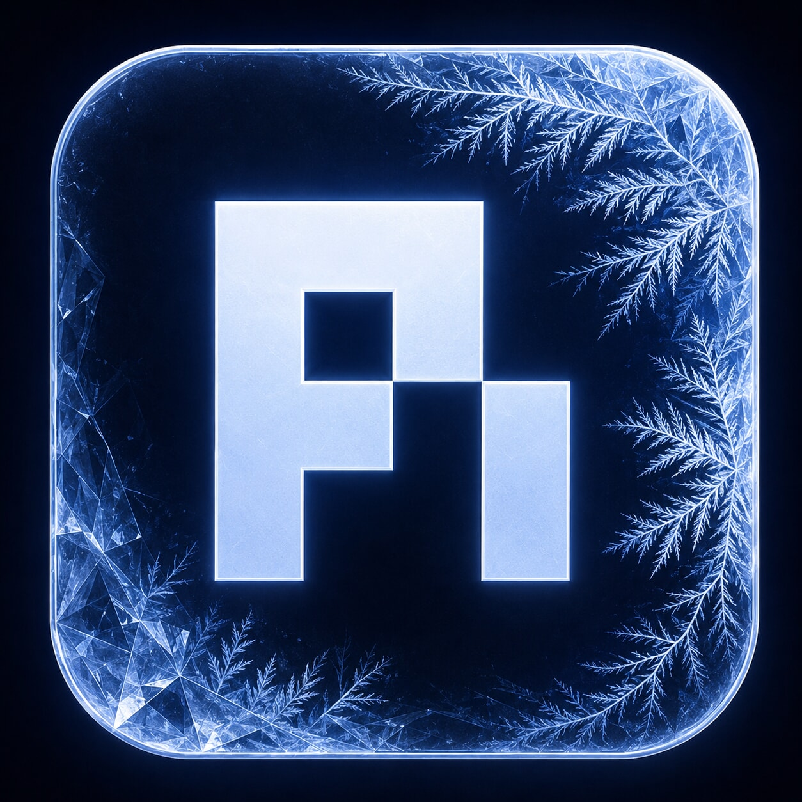
</p>

<h1 align="center">Pi VS Code UI — FrostPi</h1>

<p align="center">
  <strong>Pi Coding Agent 的 VS Code 图形界面，直接使用你已有的 Pi 配置与工作流。</strong>
</p>

<p align="center">
  <a href="README.md">English</a> · 简体中文
</p>

FrostPi 将你现有的 Pi Coding Agent 工作流带入 VS Code，同时保留你的配置、扩展、模型和会话。

<p align="center">
  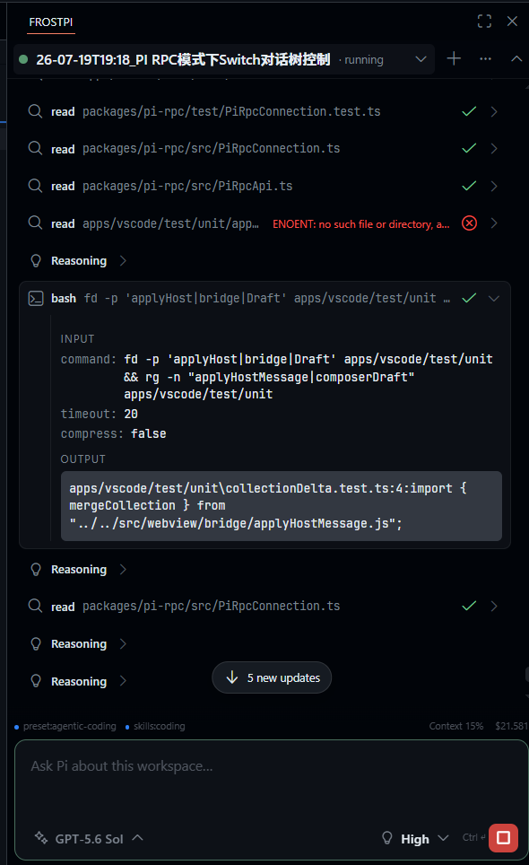
</p>

本扩展已发布到 **[VS Code Marketplace](https://marketplace.visualstudio.com/items?itemName=frostime.frostpi)** 和 **[Open VSX](https://open-vsx.org/extension/frostime/frostpi)**。

如果你的网络环境无法访问扩展市场，也可以从 [GitHub Releases](https://github.com/frostime/pi-vscode-ui/releases) 下载 `.vsix` 文件并手动安装。

## 为什么选择 FrostPi

如果你已经在使用 Pi，并围绕它建立了自己的工作流，那么获得一个图形界面不应该意味着改用另一套工作流。

FrostPi 使用**你的 Pi、你的配置、你的扩展、你的模型和你的会话**。它不会维护一套并行的 Pi 配置，不会注入系统提示词，也不会试图替你管理工作流。

**FrostPi 负责图形界面，Pi 继续掌控一切。**

## 亮点

**尽力在 GUI 中提供完整的 Pi 体验。**

FrostPi 致力于让 Pi 的功能性工作流都能在图形界面中使用：扩展命令、提示词模板、技能、模型选择、思考级别、Resume、`/compact`、树摘要、自定义扩展消息等。

会话渲染支持有序的思考过程、工具活动、命令输出、错误、图片、包含 Mermaid 的富 Markdown、压缩记录、分支摘要以及扩展定义的自定义消息。

<table>
  <tr>
    <td width="50%" align="center">
      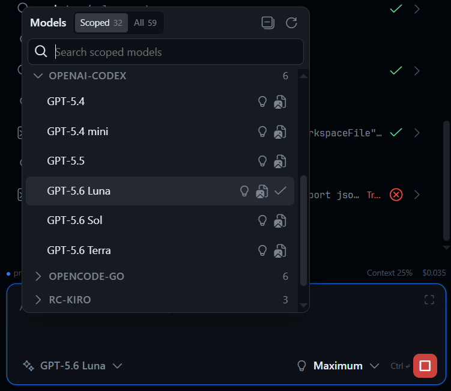
      <br>
      <sub>模型和思考控制</sub>
    </td>
    <td width="50%" align="center">
      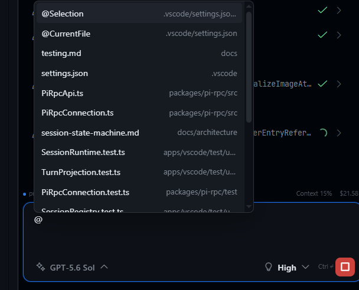
      <br>
      <sub>工作区感知的提示词</sub>
    </td>
  </tr>
  <tr>
    <td width="50%" align="center">
      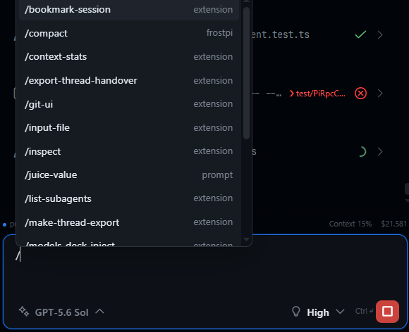
      <br>
      <sub>扩展命令、提示词和技能</sub>
    </td>
    <td width="50%" align="center">
      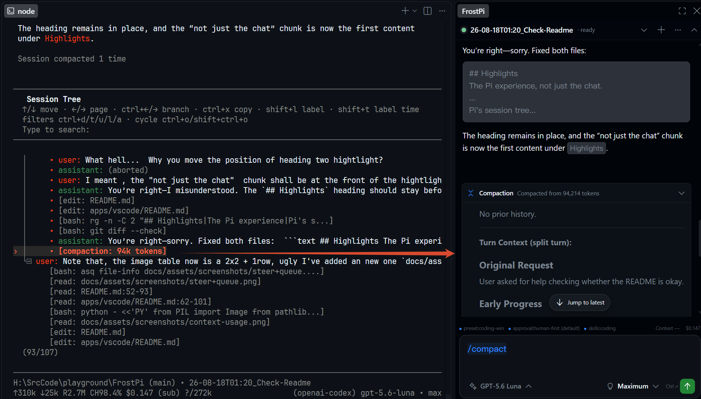
      <br>
      <sub>原生压缩消息</sub>
    </td>
  </tr>
  <tr>
    <td width="50%" align="center">
      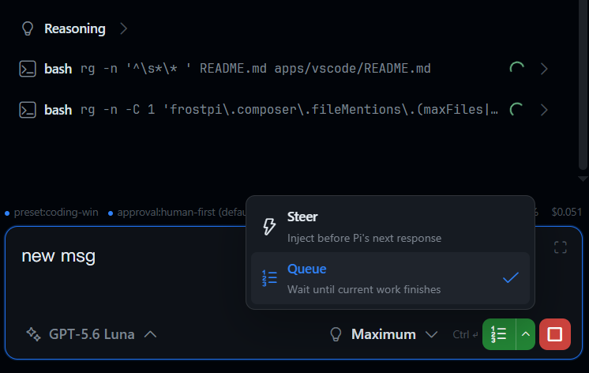
      <br>
      <sub>Steer 和队列控制</sub>
    </td>
    <td width="50%" align="center">
      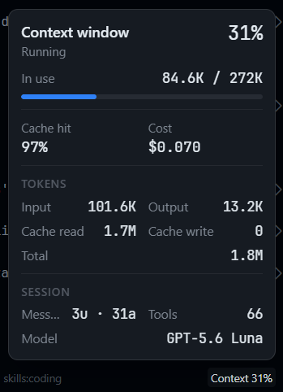
      <br>
      <sub>上下文、Token 使用量和预计会话成本</sub>
    </td>
  </tr>
</table>

**在图形界面中直接使用 Pi 的会话树。**

Pi 会话是树，而不只是线性的聊天记录。FrostPi 将 Pi 原生的树工作流以图形化控件呈现：从较早的提示词创建分支、在已有路径之间切换，并可选择通过分支摘要保留上下文。

<p align="center">
  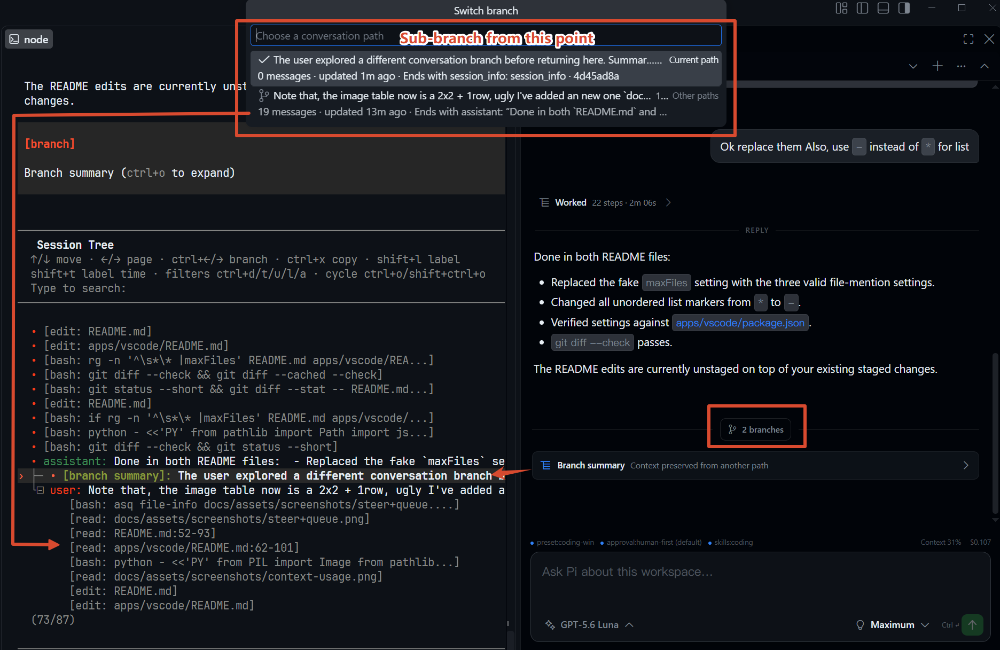
</p>

**需要另一个会话时再 Fork。**

树导航会停留在当前 Pi 会话和会话文件中。Fork 则有意采用不同的机制：它会创建独立的 Pi 会话和 FrostPi 会话，让后续流程可以独立运行并持久保存。

**并行运行 Pi——包括跨 Git worktree。**

创建、恢复、切换、重命名并并行运行多个独立的 Pi 会话。如果工作区属于包含 Git worktree 的仓库，FrostPi 也可以从这些 worktree 中启动或恢复会话。

<table>
  <tr>
    <td width="50%" align="center">
      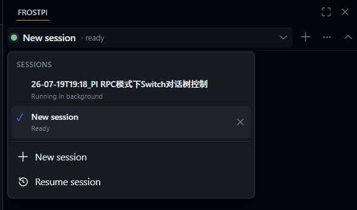
      <br>
      <sub>独立的并行会话</sub>
    </td>
    <td width="50%" align="center">
      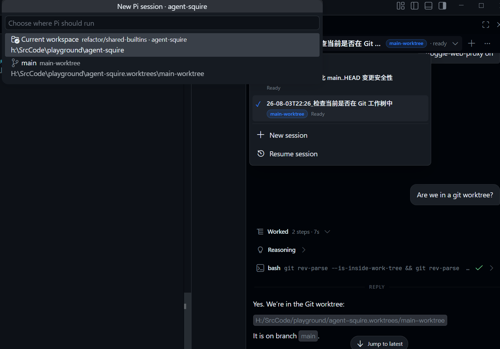
      <br>
      <sub>跨 Git worktree 的会话</sub>
    </td>
  </tr>
</table>

**对话渲染，而不是压成纯文本。**

Agent 的输出保持可读，不会退化成一堆纯文本：

- 完整 **Markdown**：经过消毒处理，代码围栏带语法高亮。
- **Mermaid** 图表——流式输出期间未完成的围栏保持源码显示，完整后才渲染为图表。
- **数学公式**：基于 KaTeX，支持行内 `$...$` 与块级 `$$...$$`。
- **嵌入图片**——PNG、JPEG、WebP、GIF、SVG，带标题、共享 Lightbox、本地图片懒加载，远程 HTTPS 图片需点击加载。
- **Diff 展示**——`diff`/`patch` 围栏与工具 diff 采用 VS Code diff 配色，并可深入到行内逐词标注增删。

<p align="center">
  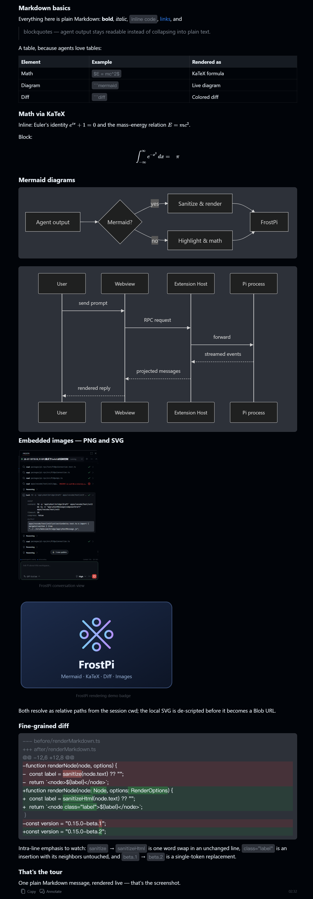
  <br>
  <sub>一条助手消息的实时渲染</sub>
</p>

## 开始使用

### 环境要求

- VS Code 1.99 或更高版本。
- 受信任的文件系统工作区。
- 在 VS Code Extension Host 所在的同一环境中安装并配置 Pi。
- Pi 可以通过 `PATH` 中的 `pi` 使用，或者通过 `frostpi.pi.executable` 配置。
- 建议在 Extension Host 的 `PATH` 中安装 `fd` 和 `rg`。

Remote SSH、WSL 和 Dev Container 工作区会在远程工作区 Extension Host 中运行 FrostPi 和 Pi。FrostPi 不会把本地 Pi 进程桥接到远程文件系统。

### 设置

1. 在 VS Code 中安装 FrostPi。
2. 打开一个受信任的工作区。
3. 从 Activity Bar 打开 FrostPi。该视图也可以移动到 Secondary Sidebar。
4. 启动新会话、恢复已有 Pi 会话，或将提示词粘贴到编辑框中。
5. 如果 Pi 不在 `PATH` 中，请运行 **FrostPi: Configure Pi Executable**。

可配置的可执行文件可以是 `pi` 命令、原生可执行文件的绝对路径，或 Pi 编译后的 `cli.js` 路径。

## 参考

### 提示词与工作区上下文

可以直接将 PNG、JPEG 或 WebP 图片粘贴到编辑框中。

使用 `/` 补全来查找 Pi 扩展命令、提示词模板、技能和 FrostPi 本地操作。

流式 Mermaid 行为、图片加载规则、diff 强调等渲染细节见 [`apps/vscode/src/webview/features/conversation/markdown/markdown.SPEC.md`](apps/vscode/src/webview/features/conversation/markdown/markdown.SPEC.md)。

使用 `@Selection`、`@CurrentFile` 或 `@path/to/file` 引用工作区内容。FrostPi 会将路径和行号信息插入提示词；至于是否读取文件以及如何读取，仍由 Pi 决定。

### 模型与会话

运行多个独立的 Pi 会话，切换提供商和模型，恢复已有会话，并且只选择当前模型的 Pi 元数据所公开的思考级别。

当其他会话在后台继续运行时，会话状态仍然可见。

### Pi 会话树与 Fork

FrostPi 为 Pi 的会话树工作流提供图形界面：

- **Branch here**：跳转到较早的用户提示词，恢复到 Composer，并在同一个 Pi 会话和会话文件中继续为另一条路径。
- **Switch branch**：打开可搜索的原生 VS Code 选择器来选择已有路径。路径行会显示消息数量、最后更新时间和结束上下文。离开当前路径时，可以不使用摘要、使用 Pi 默认的分支摘要，或提供自定义的摘要重点说明。
- **Fork**：创建独立的 Pi 会话和 FrostPi 会话。当后续流程应独立运行并持久保存，而不是成为当前会话树中的另一条路径时，可以使用它。

当前树叶和重建后的会话上下文仍由 Pi 负责。FrostPi 提供图形界面兼容层。

对于 Pi RPC 没有直接暴露的图形界面树操作，FrostPi 会通过 Pi 的扩展机制加载一个小型的进程内适配器。该适配器只负责衔接图形界面操作，不会替代 Pi 的树实现。

### 问题工具

FrostPi 提供一个可选的 `question` 工具，可以直接在 Webview 中回答 agent 的问题。该功能**默认禁用**。

设置：

```text
frostpi.questionTool.enabled
```

即可为新启动的 Pi 会话进程启用该功能。修改设置后，需要重启已经运行的会话。

启用后，问题请求会显示在会话下方一个有边界且可折叠的面板中。每个问题都必须明确回答并点击 **Submit**，包括只有一个问题的请求。

该工具默认选择加入，是因为它与树适配器不同，会注册一个模型可见的 Pi 工具。

Pi 会先加载项目级和全局扩展，然后加载 FrostPi 显式注入的扩展。如果其他扩展已经注册了 `question`，则优先保留已有注册。

FrostPi 启动的每个 Pi 子进程都会收到：

```text
PI_INSIDE_FROSTPI=1
PI_INSIDE_FROSTPI_VERSION=<extension version>
```

第三方 Pi 扩展可以读取这些变量，以检测自己是否在 FrostPi 下运行，以及启动它们的 FrostPi 版本。例如，第三方 question 扩展可以在用户偏好使用 FrostPi Webview 问题工具时，有条件地跳过自身注册。

无论内置问题工具是否启用，`PI_INSIDE_FROSTPI` 都表示 FrostPi 的存在。因此，扩展**不应仅仅因为存在这个变量就无条件禁用自身**。

### 网络与诊断

FrostPi 为 Pi 子进程支持继承、VS Code、自定义和直连代理模式。

自定义代理模式接受：

- `host:port`
- `http://...` 或 `https://...`
- `socks5://...`

代理用户名和密码会存储在 VS Code SecretStorage 中，而不是 `settings.json` 中。

代理配置会在 Pi 进程启动时解析。修改代理设置不会更新已经运行的会话；请重启受影响的会话以应用新的环境。代理环境变量也会被 Pi 启动的命令继承。

FrostPi 还提供上下文指标、诊断导出、严格的 LF 分隔 JSONL 传输，以及经过 schema 检查的 Host-Webview 消息。

### 设置

常用设置包括：

- `frostpi.pi.executable`
- `frostpi.pi.runtimeCompatibility` — 选择有限的 Pi 或 Oh My Pi 兼容契约；这不代表启用 OMP 的全部专属功能。
- `frostpi.pi.arguments`
- `frostpi.session.startOnOpen`
- `frostpi.composer.streamingBehavior`
- `frostpi.composer.fileMentions.respectSearchExclude`
- `frostpi.composer.fileMentions.respectIgnoreFiles`
- `frostpi.composer.fileMentions.followSymlinks`
- `frostpi.attachments.maxImageBytes`
- `frostpi.questionTool.enabled`
- `frostpi.network.proxy.mode`
- `frostpi.network.proxy.endpoint`
- `frostpi.network.proxy.noProxy`
- `frostpi.diagnostics.level`

使用 **FrostPi: Configure Network Proxy** 或会话菜单选择 User/Workspace 作用域，并配置当前代理模式。运行中的会话会显示 `restart required`，直到被明确重启。

### 字体

在已安装的 VS Code 版本支持时，FrostPi 会在这些 VS Code Chat 设置发生变化后立即跟随它们：

- `chat.fontFamily` — 渲染后的 Markdown 消息文本。
- `chat.fontSize` — 渲染后的消息和代码块大小。
- `chat.editor.fontFamily` — Composer 和 Markdown 代码块字体。
- `chat.editor.fontSize` — Composer 大小。

当 Chat 字体保持为 `default` 时，FrostPi 会回退到 VS Code 的常规界面字体或编辑器字体。

### 对 `oh-my-pi` 的有限兼容

从 v0.15.0 起，FrostPi 对 `oh-my-pi` 做了有限的兼容。用户可以通过如下做法来切换使用 omp

在 VS Code 设置中将 `FrostPi: Pi Runtime Compatibility` 设置为 `oh-my-pi`；可在 `settings.json` 中配置：

```json
{
  "frostpi.pi.runtimeCompatibility": "oh-my-pi"
}
```

设置之后影响:

- 默认使用 `omp` 而非 `pi`

  注意，如果 `omp` 不在 `PATH` 中，可以另外配置 `frostpi.pi.executable` 指向它的可执行文件。
- 默认从 `.omp/sessions` 而非 `.pi` 中读取历史回话记录

  如果使用了自定义会话目录或模型范围，可以通过`frostpi.pi.arguments`传入 `--session-dir`

**限制**:

我们只做了最小兼容。此兼容只能确保: FrostPi 能够按照 OMP 的基础兼容约定启动 `omp --mode rpc`，进行基本的对话、工具调用、模型切换，以及在 OMP 默认或显式指定的会话目录中发现和恢复会话。

但在 FrostPi 中可能无法获得 omp 的完整体验 —— 由于 omp RPC 格式在某些方面并不兼容，树、Fork 等高级功能在 omp 会话中同样被禁用，待后续集成。

目前，`/` 斜杠命令只支持 OMP 的 command 文件（`.omp/commands/*.md`，暂不支持 `prompts/*.md`）和 skill 命令（`/skill:<名称>`）；其余斜杠命令暂不可用。

### 开发

```bash
pnpm install --frozen-lockfile
pnpm check
pnpm package:vsix
pnpm verify:vsix
pnpm package:zip
```

工作区包含：

- `packages/pi-rpc` — Pi 子进程传输和类型化 RPC API。
- `apps/vscode` — Extension Host、稳定的 Host-Webview 契约和 Svelte UI。
- `docs` — 架构、协议、UI、测试、隐私和发布文档。

请从 [`.dev/docs/index.md`](.dev/docs/index.md) 开始。行为兼容性契约位于各模块旁边的 `*.SPEC.md` 或 `SPEC.md` 文件中。

### 隐私与许可证

FrostPi 不包含遥测、远程服务或其他自有的在线服务。提示词和图片会传递给本地启动的 Pi 进程。

详情请参阅 [`PRIVACY.md`](PRIVACY.md) 和 [`THIRD_PARTY_NOTICES.md`](THIRD_PARTY_NOTICES.md)。

FrostPi 采用 **AGPL-3.0-only** 许可证。

FrostPi 是独立的客户端，并非 Pi 的官方发行版。


## USER QUESTOIN

### 既然定位 `non-intrusive` 为什么还提供 `question` 工具

我们尽量不去触碰用户 Pi 运行时内部，但:

- Questoin/Ask 工具是 Agentic Coding 必要的工具
- 常见的 Question/Ask 类工具依赖复杂 TUI，无法在GUI中生效

因此，我们将其作为少数例外，以可选的方式提供；建议启用者禁用本地的其他 question 类工具避免冲突。

### 对 Pi 运行时实际做了哪些影响

影响有限，抛开默认禁用的 question 工具外。

如果你配置了 Proxy，会在启动时设置代理环境变量。

同时 FrostPi 会注入一个 `session-tree-adapter` 扩展用来在 GUI 中支持 Pi 的 tree 功能 —— 但请放心，这个扩展不会写入 PI 家目录中，也不会干扰 Agent 运行的上下文。对用户来说它是无感运行的。

### 为什么要求安装 `fd` 和 `rg`

并非强制要求，没有安装也不会造成实质性影响。

但 FrostPi 的 `@` 补全文件功能底层依赖 `fd`，session resume 功能会利用 `rg` 来加速解析 session file。安装二者对使用体验有帮助。

### 会提供和 `vscode` 集成的 Pi 扩展工具吗？

当下没有。但可能在未来集成读取 VsCode Workspace 状态的工具。我们会以克制的方式引入，且所有新引入的扩展类功能，总是默认禁用。

### Write 工具只显示了 `+<lines>` 没有像 `edit` 那样同时显示文件增减，这是为什么

详情请见 github issue `#6`。

TLDR: PI 内置 write 工具只返回更改后的结果，不返回 diff，FrostPi 无法获取实际变更信息。

但 FrostPi 会把所有 details 中返回 `diff` 的工具当做 `edit` 类工具处理，你可以自己开发扩展实现。例如可使用如下 Prompt 发给 AGENT:

> 请在 PI 家目录中实现一个 extension，效果是覆盖 Pi 内置 `write` 工具，让 details 中返回类似 `edit` 工具的 `diff: string` 内容。允许简单地把 `-oldcontent` 和 `+newcontent` 拼接起来，只需要确保反应实际的变更行数即可，无需做精准的 hunk position 匹配。

FrostPi 不会帮你实现这个 extension，我们尽量避免和用户自己的扩展冲突，更不会偷偷在内部变更 PI 的执行行为。
